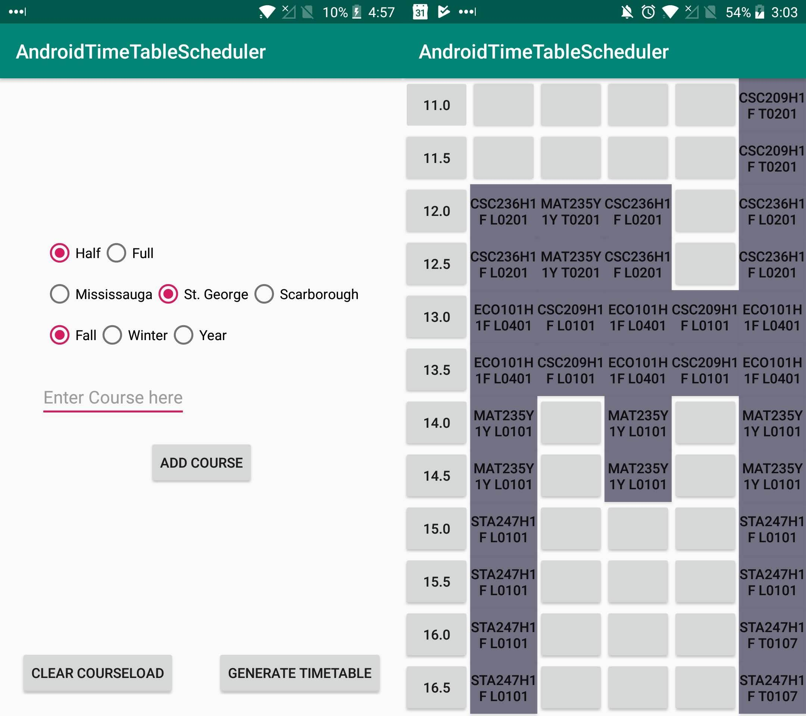

# AndroidTimeTableScheduler
Generate the perfect timeTable to fit all of your preferences: time of day, number of classes per day, preffered professors, distance between classes, etc.

Designed for the university of toronto timetabling system, can be easily extended.

